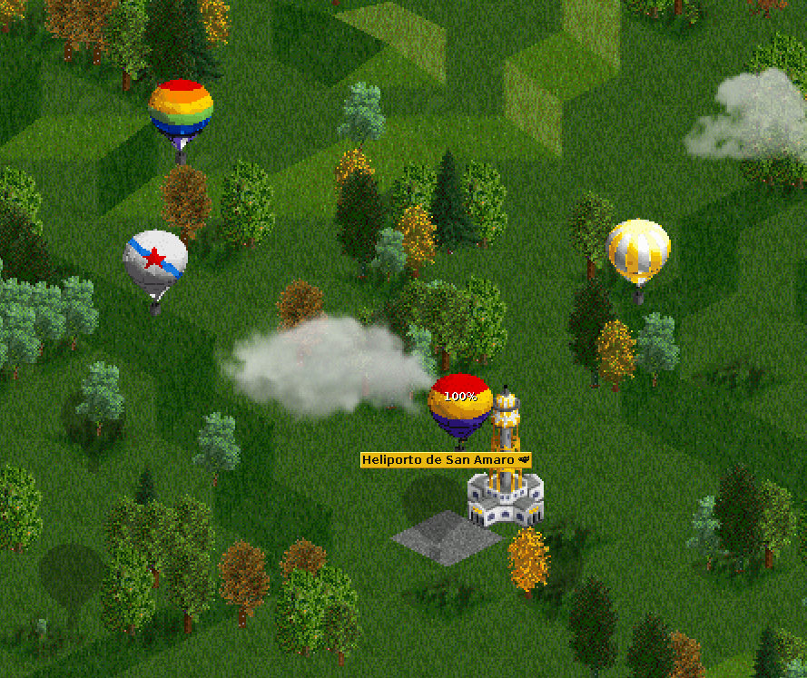

# Mast & Hot Air Balloons
[![GitHub license][license-shield]][license-url] [![BaNaNaS URL][bananas-shield]][bananas-url]

<!-- TABLE OF CONTENTS, generated with gh-md-toc README.md (see #acknowledgements) -->

Table of Contents
=================

* [Mast &amp; Hot Air Balloons](#mast--hot-air-balloons)
* [Table of Contents](#table-of-contents)
   * [About The Project](#about-the-project)
   * [Getting Started](#getting-started)
      * [Requirements](#requirements)
      * [Installation](#installation)
      * [How to Compile it (from Linux)](#how-to-compile-it-from-linux)
   * [Usage](#usage)
   * [Support &amp; Contributing](#support--contributing)
   * [Authors](#authors)
   * [Acknowledgements](#acknowledgements)
   * [License](#license)

<!-- ABOUT THE PROJECT -->

## About The Project

Airship Mast & Hot Air balloons.

<!-- GETTING STARTED -->
## Getting Started
### Requirements

- OpenTTD (<http://www.openttd.org>).

### Installation

- Download it through the integrated content manager in the game or through [BaNaNaS](http://bananas.openttd.org)
- You may also [manual install it](https://wiki.openttd.org/en/Manual/NewGRF#manual-install), download or compile the `.grf` and put it on the OpenTTD `newgrf` directory.

### How to Compile it (from Linux)

- [Install NML with its requirements](http://newgrf-specs.tt-wiki.net/wiki/NML:Getting_started)
- Download last version from this repository <https://github.com/GalizaTTD/galician-houses>
- "pandoc" command is used to generate txt docs from github docs (LICENSE, CHANGELOG & README)
- In order to compile the NewGRF you only need to execute `make` command.
- You can install it directly on the game customizing `INSTALL_DIR` on `Makefile.config` and running `make install`.

<!-- USAGE EXAMPLES -->
## Usage

- Once installed, start a new game and you'll have the new Airship Mast under the Helipads, as well as the mast object in Objects.
- Hot Air Balloons have to be reffited to change its appeareance between the available options.

<!-- CONTRIBUTING -->

## Support & Contributing

If you want to add any missing feature or report a bug, you [can request ir or report it here][issues-url]. Also if you are want and know how to do it, go ahead! That's what make the open source community shines, by allowing us to grow and learn from each other creating amazing tools! Any contribution you make is **greatly appreciated**.

1. Fork the Project
2. Create your Feature Branch (`git checkout -b feature/AmazingFeature`)
3. Commit your Changes (`git commit -m 'Add some AmazingFeature'`)
4. Push to the Branch (`git push origin feature/AmazingFeature`)
5. Open a Pull Request

## Authors

- Pablo Villaverde Castro - [@fedello](https://mastodon.gal/@fedello)
- [2TallTyler](https://mastodon.gal/@randomHose) - Original Airship Mast
- [Zephyris](https://www.tt-forums.net/viewtopic.php?p=964420#p964420) - Original Sprites
- [Supercheese](https://www.tt-forums.net/memberlist.php?mode=viewprofile&u=22275) - Original Hot Air Balloon code & sound effect

<!-- ACKNOWLEDGEMENTS -->

## Acknowledgements
* [NML Tutorial](https://newgrf-specs.tt-wiki.net/wiki/NML:Main)
* [TOC Generator](https://github.com/ekalinin/github-markdown-toc)
* [MakeFile Tutorial](https://makefiletutorial.com/)
* [Original Hot Air Balloon](https://www.tt-forums.net/viewtopic.php?f=26&t=56072&start=20#p971461)
* [Airship Mast](https://github.com/2TallTyler/airship_mast) - Inspiration on code & Graphics for the Airship mast
* [WorldAirlinerSet](https://www.tt-forums.net/viewtopic.php?t=39227) - Inspiration on code

## License

[![GitHub license][license-shield]][license-url]

Distributed under the GNU GPL-v3 License. See [LICENSE][license-url] on for more information.

<!-- MARKDOWN LINKS & IMAGES -->
<!-- https://www.markdownguide.org/basic-syntax/#reference-style-links -->
[license-shield]: https://img.shields.io/badge/license-GNU%20GPL--v3-brightgreen
[bananas-shield]: https://img.shields.io/badge/BaNaNaS-1.0.0-informational
[license-url]: https://github.com/GalizaTTD/hot-air-balloons/blob/main/LICENSE
[project-url]: https://github.com/GalizaTTD/hot-air-balloons
[issues-url]: https://github.com/GalizaTTD/hot-air-balloons/issues
[bananas-url]: https://bananas.openttd.org/manager/newgrf/4b463037